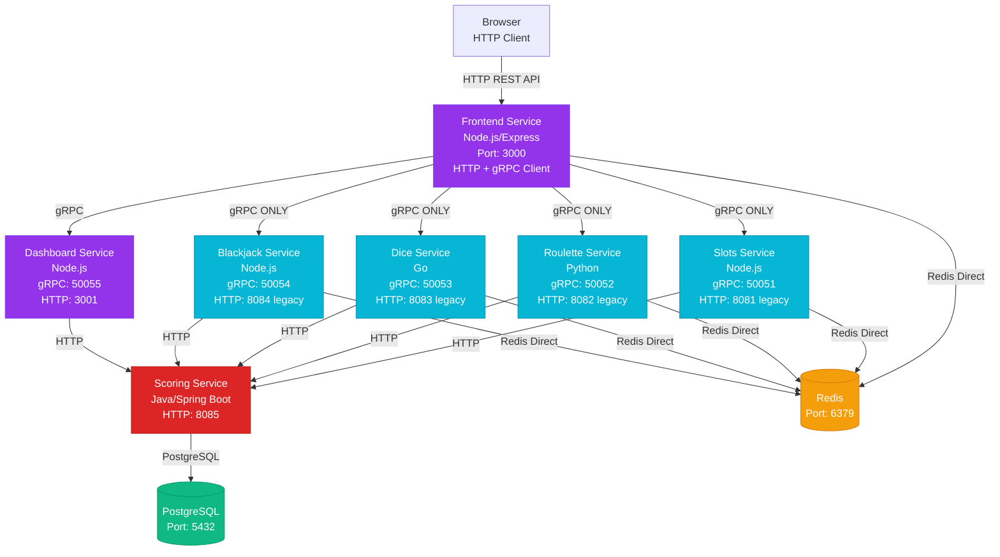
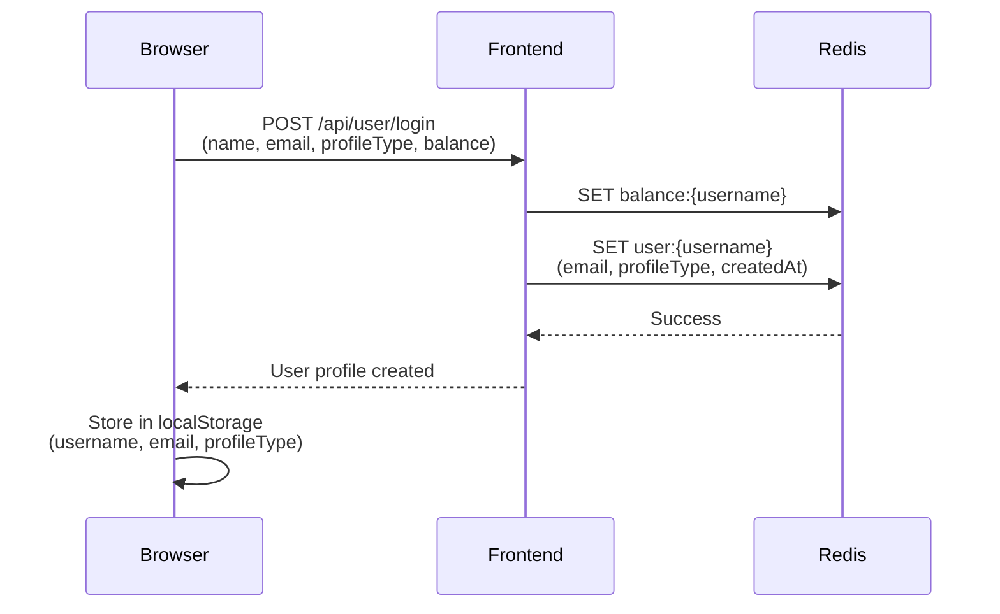
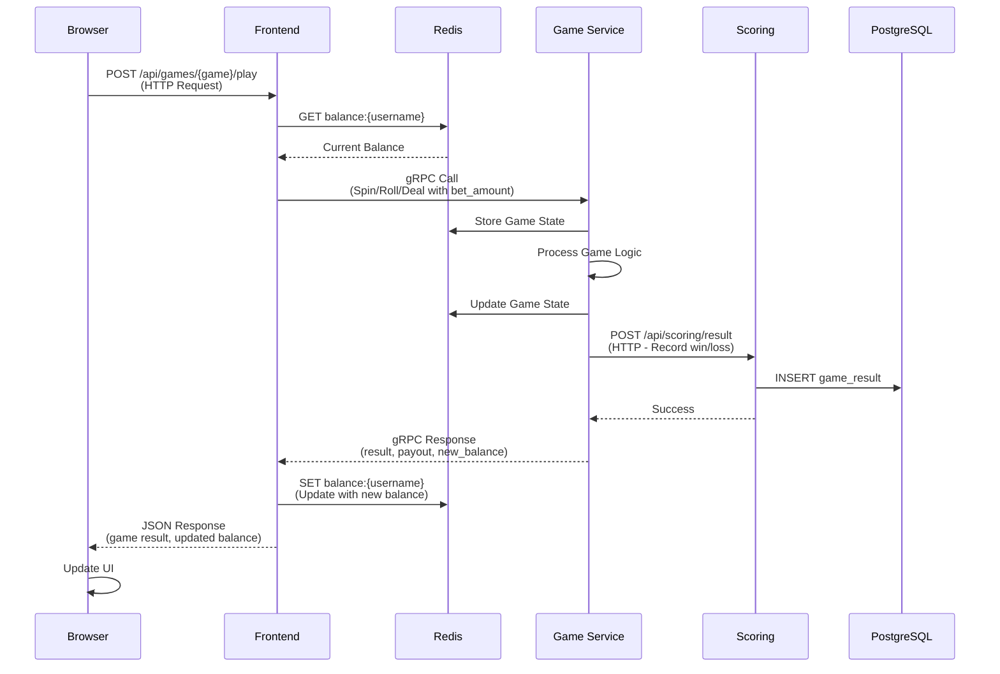
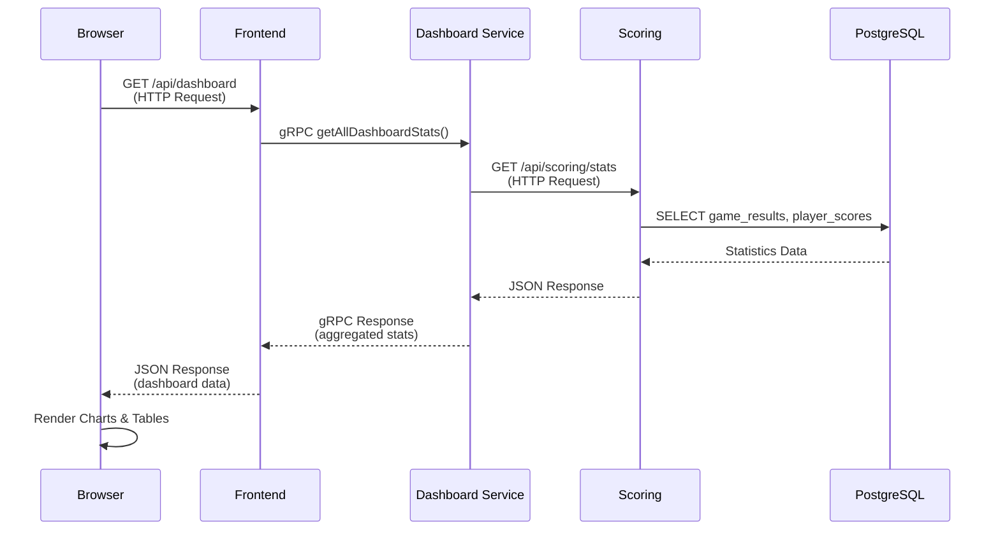
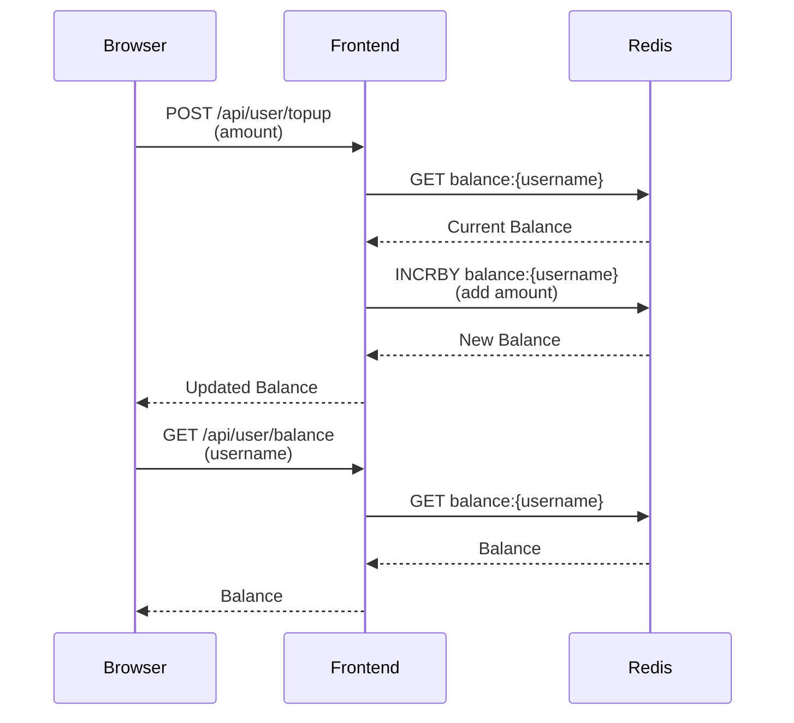
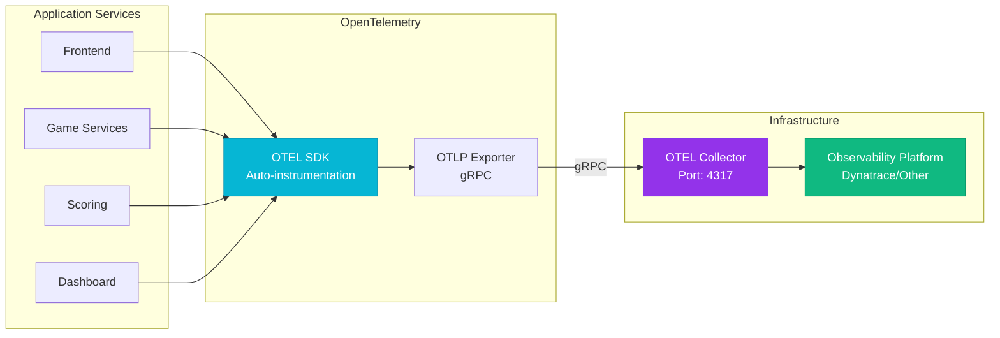
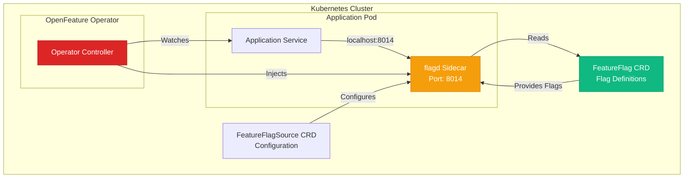

# Architecture Overview

## System Architecture

Vegas Casino follows a **microservices architecture** with multiple independent services. The frontend service uses **gRPC exclusively** to communicate with game services (no HTTP fallback). HTTP is only used for browser-to-frontend communication and service-to-scoring communication.

## Service Communication

### HTTP Communication
- **Browser → Frontend Service**: All browser requests use HTTP (Port 3000)
  - Static files (HTML, CSS, JS)
  - REST API endpoints:
    - `/api/user/*` - User management (login, balance, topup, init)
    - `/api/games/:gameId/spin` - Game play (internally converts to gRPC)
    - `/api/games/:gameId/roll` - Game play (internally converts to gRPC)
    - `/api/games/:gameId/deal` - Game play (internally converts to gRPC)
    - `/api/dashboard/*` - Dashboard data (internally converts to gRPC)
- **Dashboard → Scoring Service**: HTTP REST API (Port 8085)
- **Game Services → Scoring Service**: HTTP REST API for recording game results

### gRPC Communication (Service-to-Service)
- **Frontend → Game Services**: **ONLY gRPC** (no HTTP fallback)
  - All game interactions use gRPC exclusively:
    - Slots: `Spin()` method via gRPC (Port 50051)
    - Roulette: `Spin()` method via gRPC (Port 50052)
    - Dice: `Roll()` method via gRPC (Port 50053)
    - Blackjack: `Deal()`, `Hit()`, `Stand()`, `Double()` methods via gRPC (Port 50054)
  - **No HTTP fallback**: If gRPC fails, the request fails (no HTTP retry)
- **Frontend → Dashboard Service**: gRPC (Port 50055) for dashboard statistics
  - Methods: `getAllDashboardStats()`, `getDashboardStats(game)`
- **Protocol**: Protocol Buffers for type safety and better performance
- **Important**: Frontend HTTP endpoints (`/api/games/*`) are browser-facing REST APIs that internally convert to gRPC calls. The browser never directly calls game services.

### Redis Communication
- Frontend ↔ Redis (direct connection for balance and user profile management)
- Game Services ↔ Redis (direct connection for game state storage)

## Data Flow

### User Login and Profile Creation

### Game Play Flow

### Dashboard View Flow

### Balance Management Flow

## Observability Stack

- **OpenTelemetry**: Distributed tracing and metrics
- **OpenTelemetry Collector**: Receives and exports telemetry data
- **gRPC Exporter**: Sends traces to collector on port 4317
- **Trace Context Propagation**: W3C Trace Context across all services

## Feature Flag Management

- **OpenFeature Operator**: Manages flagd sidecar injection
- **flagd**: Feature flag evaluation service (sidecar)
- **FeatureFlagSource**: Kubernetes CRD for flag configuration
- **FeatureFlag**: Kubernetes CRD for flag definitions

---

**Next**: Learn about [Components](components.md) or the [Technology Stack](technology.md).

