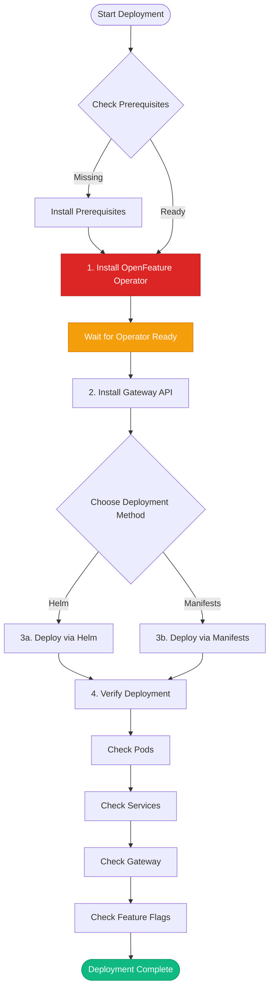

# Deployment Overview

The Vegas Casino application can be deployed to Kubernetes using either:

1. **Helm Charts** (Recommended) - Declarative, configurable deployment
2. **Kubernetes Manifests** - Direct YAML files

## Deployment Options

- **[Helm Charts](helm.md)** - Recommended way to deploy using Helm (✅ **Current & Complete**)
- **[Kubernetes Manifests](manifests.md)** - Direct Kubernetes manifest deployment (⚠️ **See k8s/ vs Helm comparison**)
- **[k8s/ vs Helm Comparison](k8s-vs-helm.md)** - Differences between k8s/ directory and Helm chart
- **[OpenFeature Operator](openfeature.md)** - Feature flag management setup
- **[CI/CD and Releases](ci-cd.md)** - GitHub Actions workflows, creating releases, and updating environments

## Prerequisites

Before deploying, ensure you have:

- ✅ **Kubernetes cluster** (v1.24+)
- ✅ **kubectl** configured
- ✅ **Helm 3.x** installed (for Helm deployment)
- ✅ **OpenFeature Operator** installed (required!)
- ✅ **Gateway API** installed (for ingress)
- ✅ **Docker images** built and pushed to registry

## Deployment Order



### 1. Install OpenFeature Operator (REQUIRED FIRST!)

**⚠️ IMPORTANT**: The OpenFeature Operator must be installed **before** deploying the application.

```bash
# Install OpenFeature Operator
helm repo add openfeature https://open-feature.github.io/open-feature-operator
helm repo update
helm install open-feature-operator openfeature/open-feature-operator \
  --namespace open-feature-system \
  --create-namespace
```

Wait for operator to be ready:
```bash
kubectl wait --for=condition=ready pod \
  -l control-plane=controller-manager \
  -n open-feature-system \
  --timeout=90s
```

### 2. Install Gateway API (if not already installed)

```bash
# Install Gateway API CRDs
kubectl apply -f https://github.com/kubernetes-sigs/gateway-api/releases/download/v1.0.0/standard-install.yaml
```

### 3. Deploy Application

Choose your deployment method:
- [Helm Charts](helm.md) (Recommended)
- [Kubernetes Manifests](manifests.md)

## Post-Deployment

After deployment, verify:

1. **Pods are running**:
   ```bash
   kubectl get pods -n vegas-casino
   ```

2. **Services are available**:
   ```bash
   kubectl get svc -n vegas-casino
   ```

3. **Gateway is accessible**:
   ```bash
   kubectl get gateway -n vegas-casino
   kubectl get httproute -n vegas-casino
   ```

4. **OpenFeature resources**:
   ```bash
   kubectl get featureflag -n vegas-casino
   kubectl get featureflagsource -n vegas-casino
   ```

## Accessing the Application

### Via Gateway External IP

```bash
# Get external IP
kubectl get gateway vegas-casino-gateway -n vegas-casino -o jsonpath='{.status.addresses[0].value}'

# Access frontend
curl http://<EXTERNAL_IP>/

# Access dashboard
curl http://<EXTERNAL_IP>/dashboard
```

### Via Port Forward (Development)

```bash
# Forward frontend port
kubectl port-forward -n vegas-casino svc/vegas-casino-frontend 3000:3000

# Access at http://localhost:3000
```

## Troubleshooting

### Pods Not Starting

```bash
# Check pod status
kubectl describe pod <pod-name> -n vegas-casino

# Check logs
kubectl logs <pod-name> -n vegas-casino
```

### OpenFeature Issues

```bash
# Verify operator is running
kubectl get pods -n open-feature-system

# Check FeatureFlagSource
kubectl describe featureflagsource -n vegas-casino

# Check flagd sidecars
kubectl get pods -n vegas-casino -o jsonpath='{.items[*].spec.containers[*].name}'
```

### Service Connectivity

```bash
# Test service connectivity
kubectl run -it --rm debug --image=curlimages/curl --restart=Never -- \
  curl http://vegas-casino-frontend:3000/health
```

---

**Next**: Learn about [Helm Deployment](helm.md) or [Kubernetes Manifests](manifests.md).

